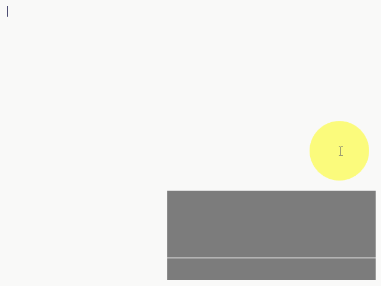
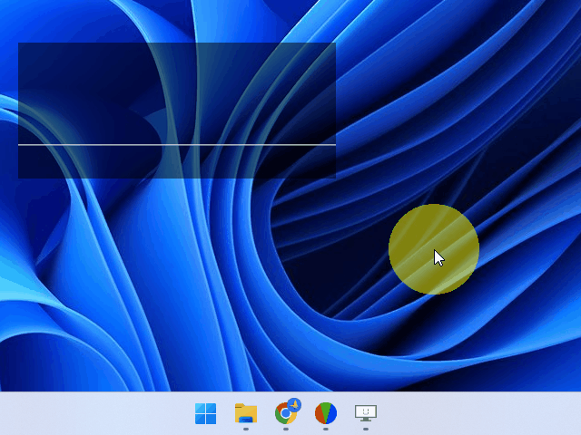

# Opecap

`Opecap` visualizes your mouse moves and keystrokes.

## Description

### Word definitions

## Demo

## VS.

## Requirement

## Usage

## Install

## Contribution

1. Fork it
2. Create your feature branch (git checkout -b my-new-feature)
3. Commit your changes (git commit -am 'Add some feature')
4. Push to the branch (git push origin my-new-feature)
5. Create a new Pull Request

## License

[Unlicense](LICENSE)

## Author

[HotariTobu](https://github.com/HotariTobu)
